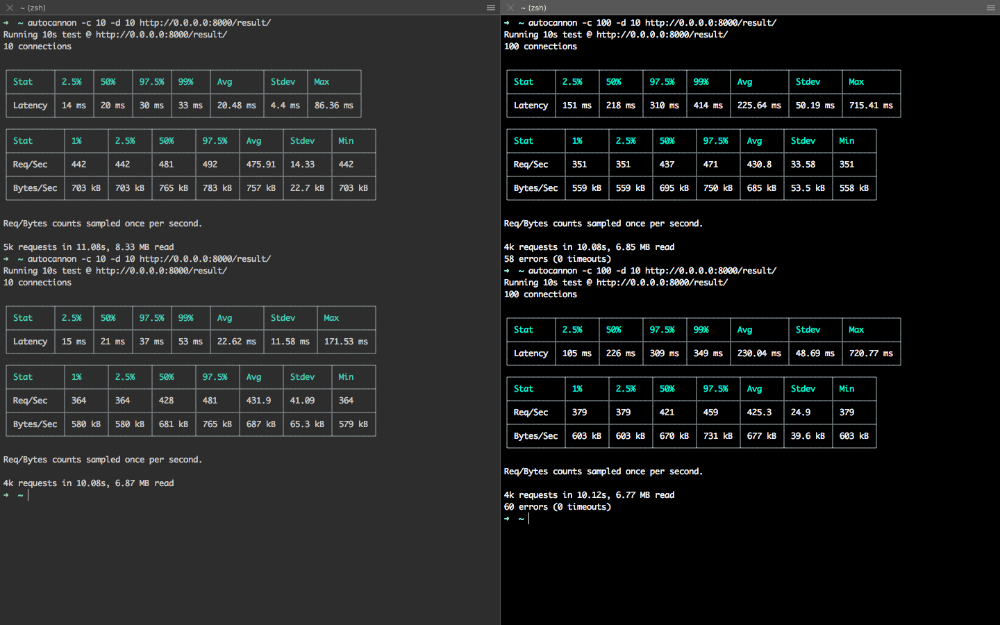
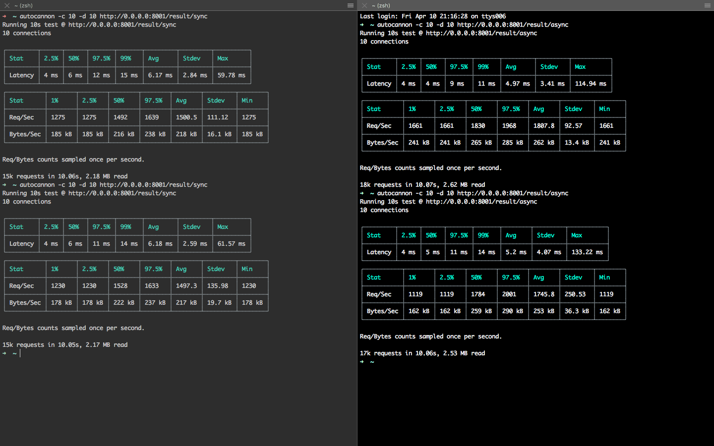
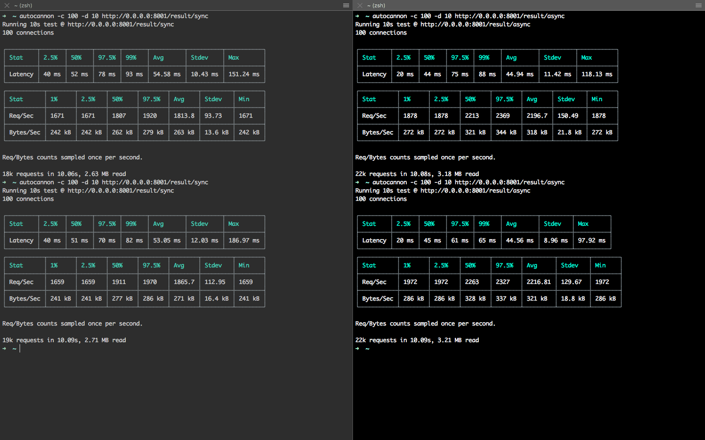
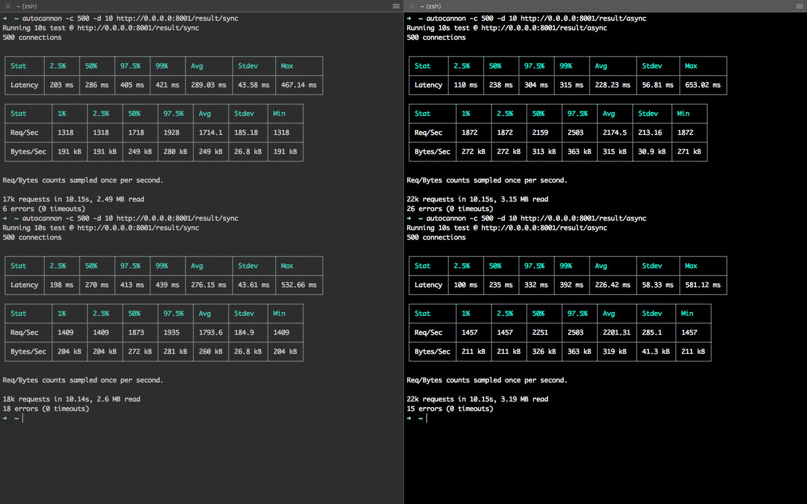
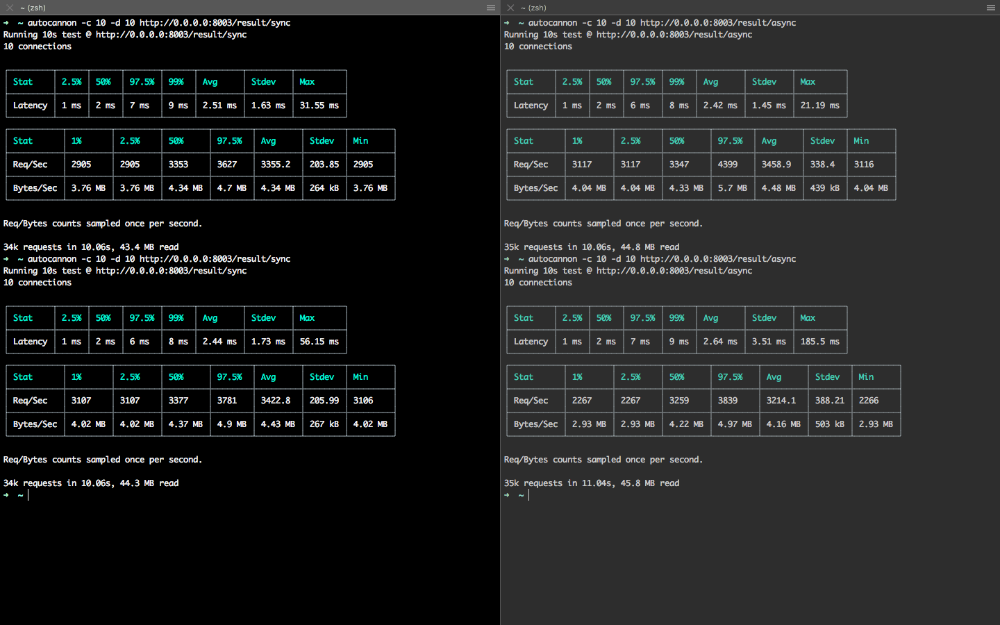
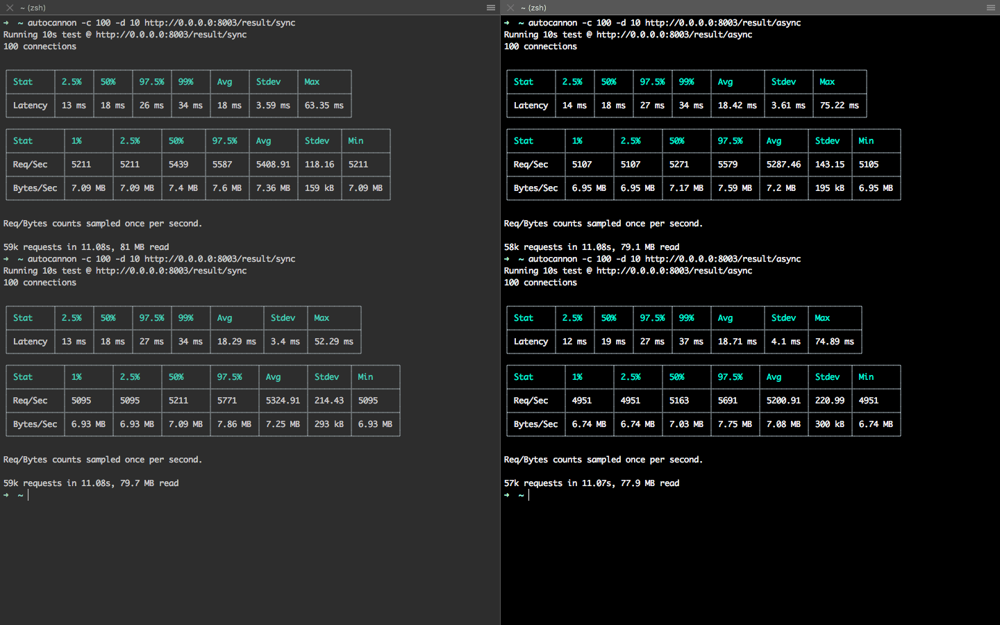
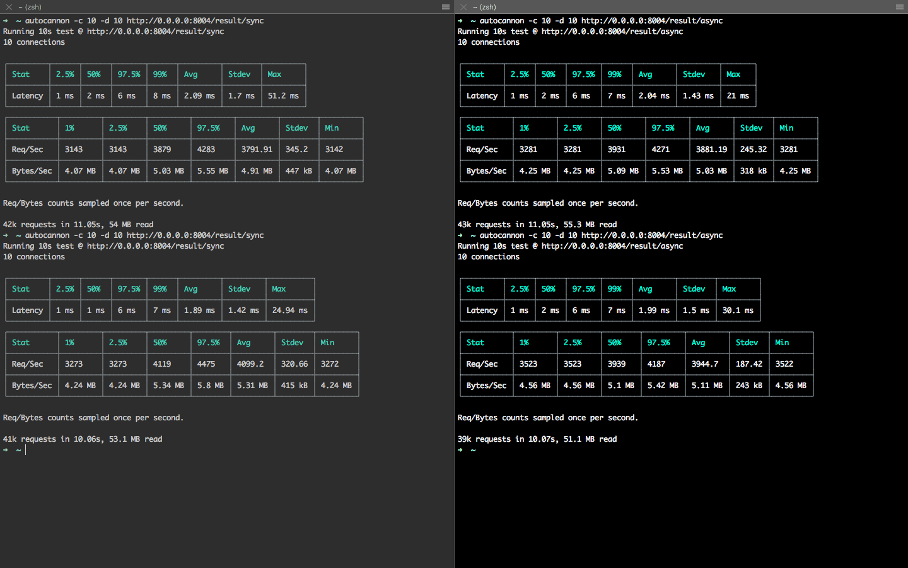
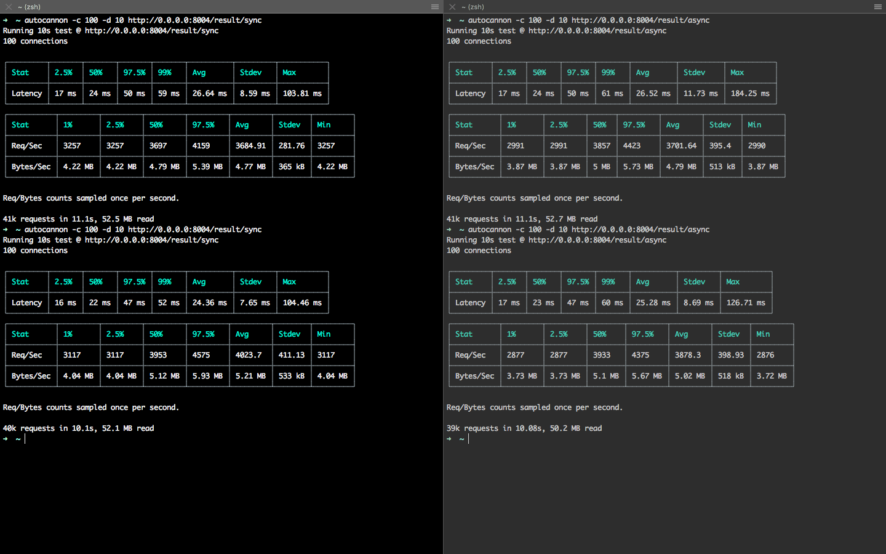

# Test #1 

## Django 
#### 10 & 100 concurrent users

## Fastapi 

#### 10 concurrent users

#### 100 concurrent users

#### 500 concurrent users

## Express 

#### 10 concurrent users

#### 100 concurrent users

#### No Logs

## Fastify 

#### 10 concurrent users

#### 100 concurrent users

#### No Logs
